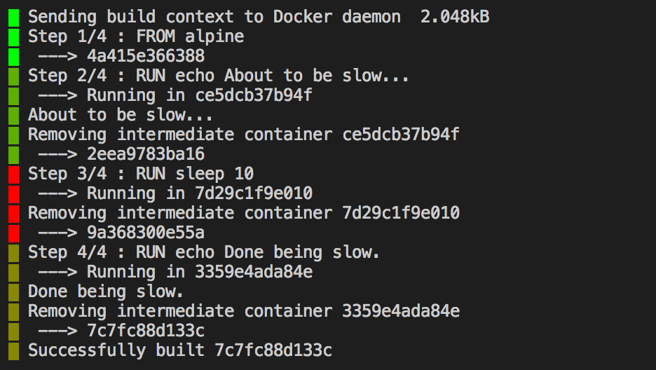

# tj - stdin line timestamps, JSON-friendly

`tj` timestamps lines read from standard input.

- [Get it](#get-it)
- [Use it](#use-it)
    - [JSON output](#json-output)
    - [Time format](#time-format)
    - [Template output](#template-output)
    - [Color output](#color-output)
    - [Stopwatch regex](#stopwatch-regex)
    - [JSON input](#json-input)
- [Example](#example)
- [Comments](https://github.com/sgreben/tj/issues/1)

## Get it

Using go get:

```bash
go get -u github.com/sgreben/tj/cmd/tj
```

Or [download the binary](https://github.com/sgreben/tj/releases/latest) from the releases page.

Also available as a [docker image](https://quay.io/repository/sergey_grebenshchikov/tj?tab=tags):

```bash
docker pull quay.io/sergey_grebenshchikov/tj
```

## Use it

`tj` reads from stdin and writes to stdout.

```text
Usage of tj:
  -timeformat string
        either a go time format string or one of the predefined format names (https://golang.org/pkg/time/#pkg-constants)
  -template string
        either a go template (https://golang.org/pkg/text/template) or one of the predefined template names
  -start string
        a regex pattern. if given, only lines matching it (re)start the stopwatch
  -readjson
        parse each stdin line as JSON
  -jsontemplate string
        go template, used to extract text from json input. implies -readjson
  -scale string
        either a sequence of hex colors or one of the predefined color scale names (colors go from fast to slow)
        (default "BlueToRed")
  -scale-fast duration
        the lower bound for the color scale (default 100ms)
  -scale-slow duration
        the upper bound for the color scale (default 2s)
  -delta-buffer
        buffer lines between -start matches, copy delta values from final line to buffered lines
```

### JSON output

The default output format is JSON, one object per line:

```bash
$ (echo Hello; echo World) | tj
```

```json
{"timeSecs":1516648762,"timeNanos":1516648762008900882,"time":"2018-01-22T20:19:22+01:00","deltaSecs":0.000015003,"deltaNanos":15003,"delta":"15.003µs","totalSecs":0.000015003,"totalNanos":15003,"total":"15.003µs","text":"Hello"}
{"timeSecs":1516648762,"timeNanos":1516648762009093926,"time":"2018-01-22T20:19:22+01:00","deltaSecs":0.000193044,"deltaNanos":193044,"delta":"193.044µs","totalSecs":0.000208047,"totalNanos":208047,"total":"208.047µs","text":"World"}
```

### Time format

You can set the format of the `time` field using the `-timeformat` parameter:

```bash
$ (echo Hello; echo World) | tj -timeformat Kitchen
```

```json
{"timeSecs":1516648899,"timeNanos":1516648899954888290,"time":"8:21PM","deltaSecs":0.000012913,"deltaNanos":12913,"delta":"12.913µs","totalSecs":0.000012913,"totalNanos":12913,"total":"12.913µs","text":"Hello"}
{"timeSecs":1516648899,"timeNanos":1516648899955092012,"time":"8:21PM","deltaSecs":0.000203722,"deltaNanos":203722,"delta":"203.722µs","totalSecs":0.000216635,"totalNanos":216635,"total":"216.635µs","text":"World"}
```

The [constant names from pkg/time](https://golang.org/pkg/time/#pkg-constants) as well as regular go time layouts are admissible values for `-timeformat`:

| Name       | Format                              |
|------------|-------------------------------------|
| ANSIC      | `Mon Jan _2 15:04:05 2006`          |
| Kitchen    | `3:04PM`                            |
| RFC1123    | `Mon, 02 Jan 2006 15:04:05 MST`     |
| RFC1123Z   | `Mon, 02 Jan 2006 15:04:05 -0700`   |
| RFC3339    | `2006-01-02T15:04:05Z07:00`         |
| RFC3339Nano| `2006-01-02T15:04:05.999999999Z07:00`
| RFC822     | `02 Jan 06 15:04 MST`               |
| RFC822Z    | `02 Jan 06 15:04 -0700`             |
| RFC850     | `Monday, 02-Jan-06 15:04:05 MST`    |
| RubyDate   | `Mon Jan 02 15:04:05 -0700 2006`    |
| Stamp      | `Jan _2 15:04:05`                   |
| StampMicro | `Jan _2 15:04:05.000000`            |
| StampMilli | `Jan _2 15:04:05.000`               |
| StampNano  | `Jan _2 15:04:05.000000000`         |
| UnixDate   | `Mon Jan _2 15:04:05 MST 2006`      |

### Template output

You can also specify an output template using the `-template` parameter and [go template](https://golang.org/pkg/text/template) syntax:

```bash
$ (echo Hello; echo World) | tj -template '{{ .I }} {{.TimeSecs}} {{.Text}}'
```

```json
0 1516649679 Hello
1 1516649679 World
```

The fields available to the template are specified in the [`line` struct](cmd/tj/main.go#L19).

Some templates are pre-defined and can be used via `-template NAME`:

| Name       | Template                                     |
|------------|----------------------------------------------|
| Color      | `{{color .}}█{{reset}} {{.Text}}`            |
| ColorText  | `{{color .}}{{.Text}}{{reset}}`              |
| Delta      | `{{.DeltaNanos}} {{.Text}}`                  |
| Time       | `{{.TimeString}} {{.Text}}`                  |
| TimeDelta  | `{{.TimeString}} +{{.DeltaNanos}} {{.Text}}` |

### Color output

To help identify durations at a glance, `tj` maps durations to a color scale. The pre-defined templates `Color` and `ColorText` demonstrate this:

```bash
$ (echo fast; 
   sleep 1; 
   echo slower; 
   sleep 1.5; 
   echo slow; 
   sleep 2; 
   echo slowest) | tj -template Color
```


The terminal foreground color can be set by using `{{color .}}` in the output template. The default terminal color can be restored using `{{reset}}`.

The color scale can be set using the parameters `-scale`, `-scale-fast`, and  `-scale-slow`:

- The `-scale` parameter defines the colors used in the scale.  
- The `-scale-fast` and `-scale-slow` parameters define the boundaries of the scale: durations shorter than the value of `-scale-fast` are mapped to the leftmost color, durations longer than the value of `-scale-slow` are mapped to the rightmost color.

There are several pre-defined color scales:

| Name                | Scale                  |
|---------------------|----------------------- |
| BlackToPurple       | `#000 -> #F700FF`      |
| BlackToRed          | `#000 -> #F00`         |
| BlueToRed           | `#00F -> #F00`         |
| CyanToRed           | `#0FF -> #F00`         |
| GreenToRed          | `#0F0 -> #F00`         |
| GreenToGreenToRed   | `#0F0 -> #0F0 -> #F00` |
| WhiteToPurple       | `#FFF -> #F700FF`      |
| WhiteToRed          | `#FFF -> #F00`         |
| WhiteToBlueToRed    | `#FFF -> #00F -> #F00` |

You can also provide your own color scale using the same syntax as the pre-defined ones.

### Stopwatch regex

Sometimes you need to measure the duration between certain *tokens* in the input.

To help with this, `tj` can match each line against a regular expression and only reset the stopwatch (`delta`, `deltaSecs`, `deltaNanos`) when a line matches.

The regular expression can be specified via the `-start` parameter.

### JSON input

Using `-readjson`, you can tell `tj` to parse each input line as a separate JSON object.  Fields of this object can be referred to via `.Object` in the `line` struct, like this:

```bash
$ echo '{"hello": "World"}' | tj -readjson -template "{{.TimeString}} {{.Object.hello}}"
```

```
2018-01-25T21:55:06+01:00 World
```

Additionally, you can also specify a template `-jsontemplate` to extract text from the object. The output of this template is matched against the stopwatch regex. 

This allows you to use only specific fields of the object as stopwatch reset triggers. For example:

```bash
$ (echo {}; sleep 1; echo {}; sleep 1; echo '{"reset": "yes"}'; echo {}) | 
    tj -jsontemplate "{{.reset}}" -start yes -template "{{.I}} {{.DeltaNanos}}"
```

```
0 14374
1 1005916918
2 2017292187
3 79099
```

The output of the JSON template is stored in the field `.JSONText` of the `line` struct:

```bash
$ echo '{"message":"hello"}' | tj -jsontemplate "{{.message}}" -template "{{.TimeString}} {{.JSONText}}"
```

```
2018-01-25T22:20:59+01:00 hello
```

## Example

Finding the slowest step in a `docker build` (using `jq`):

```bash
$ cat Dockerfile
FROM alpine
RUN echo About to be slow...
RUN sleep 10
RUN echo Done being slow
```

```bash
$ docker build . |
    tj -start ^Step |
    jq -s 'max_by(.deltaNanos) | {step:.startText, duration:.delta}'
```

```json
{"step":"Step 3/4 : RUN sleep 10","duration":"10.602026127s"}
```

Alternatively, using color output and buffering:

```bash
$ docker build . |
    tj -start ^Step -template Color -scale GreenToGreenToRed -delta-buffer
```



## Comments

Feel free to [leave a comment](https://github.com/sgreben/tj/issues/1) or create an issue.